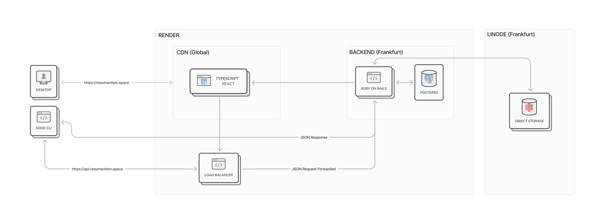

# Resurrectism Frontend

## Cloud Infrastructure

Our frontend is hosted on [render](https://render.com/) which is a PaaS (Platform-as-a-Service) Cloud Provider. The diagram below shows the interaction between the different components of our application



## Continious Integration / Continious Deployment

Our `main` branch is protected and new commits can only be added via pull request. Pull requests need to be approved and must pass all of the CI (Github Actions) checks which include proper formatting, absence of linting and type errors and of course passing tests.

Each new commit to `main` pushes the `main` branch to `production` only if all of the steps were successful. And each new commit to `production` triggers a new deploy on [render](https://render.com/).

This extra step has the added benefit of guaranteeing that the code on `main` is only deployed only if all of the steps were successful.

The diagram below shows the different steps of our CI/CD pipeline


Live version running on https://resurrectism.space

## Local Development

### Prerequisites

The following instructions have been tested **only** on `macOS`. Some adjustments for different operating system might be necessary

#### Node version

The required node version can be seen in the `.node-version` file. We recommend using [nodenv](https://github.com/nodenv/nodenv) for managing multiple node versions.

#### Yarn

Our node package manager of choice is [yarn](https://yarnpkg.com/). Brew users can install yarn by running

```sh
brew install yarn
```

### Hosts

The [api](https://github.com/resurrectism/api) has CORS enabled only for `resurrectism.test:3001` in a local environment and uses httpOnly cookies for authentication so it will be necessary to include these two lines in your `/etc/hosts` file:

```
127.0.0.1 resurrectism.test  # Necessary only for the frontend-client
127.0.0.1 api.resurrectism.test
```

### Running the Development Server

**Make sure the [api](https://github.com/resurrectism/api) is running locally beforehand**

Install dependencies:

```sh
yarn install
```

Run the application:

```sh
yarn dev
```

### Formatting/Linting

Check formatting errors with:

```sh
yarn format:check
```

Fix (if possible) formatting errors with:

```sh
yarn format
```

Check linting errors with:

```sh
yarn lint:check
```

Fix (if possible) linting errors with:

```sh
yarn lint
```

### Testing

We use [vitest](https://vitest.dev/) for testing which integrates nicely with vite and needs very minimal configuration compared to jest.

To run the test suite:

```sh
yarn test
```
